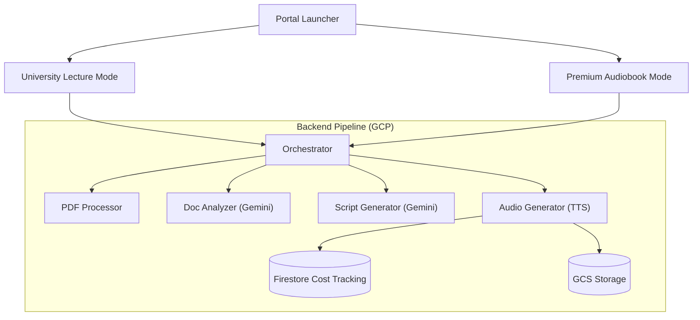

# 🎙️ Audio Intelligence Suite

**Audio Intelligence Suite** is a production-grade monorepo designed to transform physical and digital documents into high-fidelity audio experiences. Bringing together Gemini for deep analysis and Google Cloud Text-to-Speech (Journey/Studio) for narration, the suite offers two specialized modes: **University Lecture** and **Premium Audiobook**.

---

## 🏗️ Architecture



---

## ✨ Key Features

### 🎓 University Lecture Mode
Convert dense academic PDFs into structured, narrated lectures.
- **Agent Personas**: Choose from "Professor Classics" or custom agents.
- **Interactive Transcript**: Follow along with synced text highlighting.
- **Hybrid Analysis**: Intelligent fallback to OCR if Vision analysis is blocked.

### 🎧 Premium Audiobook Mode
A cinematic reading experience designed for high-end consumption.
- **Minimalist UI**: Indigo and Gold aesthetic with Playfair typography.
- **Narrative Depth**: Optimized for Journey-F (Chirp HD) high-fidelity voices.
- **Playback Controls**: 15s skip, variable speed, and offline MP3 downloads.

### 💰 Cost Monitoring
Built-in financial tracking for every job.
- **Fine-grained usage**: Tracking prompt/candidate tokens and character counts.
- **2025 Rates**: Automatically calculates estimated USD costs for Gemini 3.0 and TTS.

---

## 🚀 Quick Start

### 1. Prerequisite Setup
Ensure you have the following API keys in GCP Secret Manager or in a `.env` file:
- `GEMINI_API_KEY`
- `ELEVENLABS_API_KEY` (Optional)

### 2. Launch the Suite
Run the local orchestrator to start the portal and dependent apps:
```bash
./start_suite.sh
```
Visit **[http://localhost:3000](http://localhost:3000)** in your browser.

---

## 📖 Component Library

| Path | Purpose |
| :--- | :--- |
| `apps/portal` | The landing page entry point. |
| `apps/lecture` | The academic lecture frontend. |
| `apps/audiobook` | The premium audiobook frontend. |
| `services/` | Python microservices (FastAPI/Functions Framework). |
| `docs/` | Detailed Developer and Usage guides. |

---

## 🛡️ License
Distributed under the MIT License. See `LICENSE` for more information.

---

## 🤝 Contributing
Contributions are welcome! Please see `CONTRIBUTING.md` for our branching strategy and pull request process.
